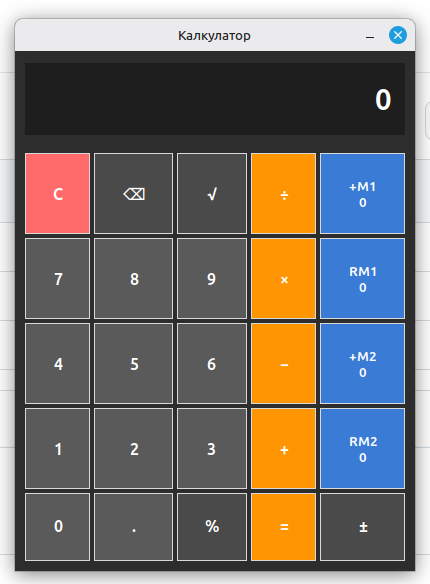

# Simple Calculator

[](https://www.python.org/)
[](https://docs.python.org/3/library/tkinter.html)
[](#how-to-install--run)
[](#how-to-install--run)
[](https://linuxmint.com/)
[](#how-to-install--run)
[](#how-to-install--run)
[](#how-to-install--run)
[-3a7bd5)](#memory-slots-m1-and-m2)
[](#simple-calculator)
[](#simple-calculator)
[](https://design.ubuntu.com/font)
[](#simple-calculator)
[](#license)
[](#license)
[](#license)
[](#license)

Simple calculator for **Linux Mint 22.2** with two independent memory slots.

Please see the picture:



---

## How to install & run

1. Cut/Paste the file `calculator.py` into your **HOME** folder.
2. Right-click on the file → **Properties → Permissions**  
   and check all **Execute** boxes.
3. Cut/Paste the file `Калкулатор.desktop` onto your **Desktop**.
4. Right-click on the `.desktop` file → **Properties → Permissions**  
   and check all **Execute** boxes.

That's it — now you can use the program.

From a terminal, if you prefer:

```bash
python3 "$HOME/calculator.py"
```

Requires Python 3 with Tkinter (already present on Linux Mint). No `pip install`.

---

## Memory slots (M1 and M2)

The calculator has two independent memory slots.

| Button | Action |
| ------ | ------ |
| **+M1** | Adds the current display value to Memory 1 |
| **RM1** | Recalls (puts) the value from Memory 1 onto the display |
| **+M2** | Adds the current display value to Memory 2 |
| **RM2** | Recalls (puts) the value from Memory 2 onto the display |

The current value of each memory is shown directly on the blue buttons.

### How to clear / reset a memory slot

There is no dedicated “Clear Memory” button.

To reset a memory slot to zero:

1. Press **RM1** (or **RM2**) to bring the stored value to the display.
2. Press **±** to change the sign (make it negative).
3. Press **+M1** (or **+M2**) — this adds the negative value and cancels the memory to **0**.

You can also just keep adding positive or negative numbers as needed.

---

## Buttons

| Key | Function |
| --- | --- |
| `C` | Clear |
| `⌫` | Backspace |
| `√` | Square root |
| `%` | Divide by 100 |
| `±` | Change sign |
| `÷` `×` `−` `+` `=` | Arithmetic |
| `0`–`9` `.` | Input |

---

## License

**Forever Free** for use by everyone: private and/or public and/or business.

You are free to use it as it is or change anything you want depending on your whims.

Any issues, questions, or if you are too lazy to do the changes yourself:

**good.vibes.github@gmail.com**
